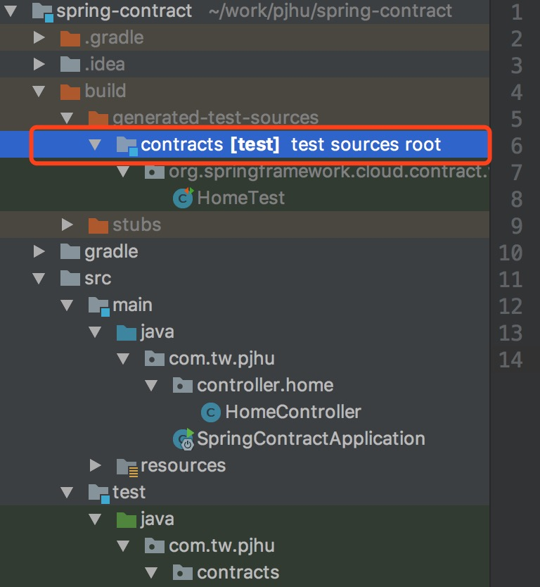
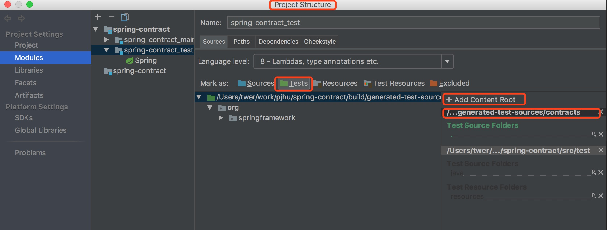

# setup
- setup nexus
    ```
    docker-compose up -d
    ```
- login
    ```
    localhost:8081
    ```
# setup contract
- setup producer
    ```
    cd producer
    ./gradlew clean generateClientStubs
    ./gradlew publishStubsPublicationToMavenRepository
    ```
    
- setup consumer
    ```
    cd consumer
    ./gradlew bootRun
    ```
- request
    ```
    curl localhost:8082/api/v1/home
    ```

# config intellij

